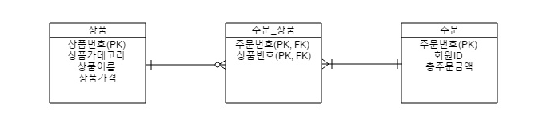
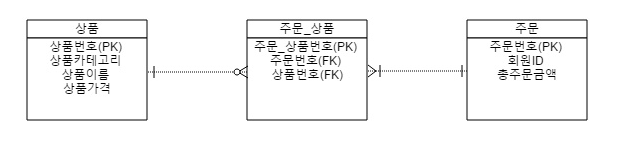

# DB

<br>

## 1. 스키마(Schema)

<br>

정의 : 데이터베이스의 구조와 제약조건에 관한 전반적인 명세를 기술한 것.

- 데이터베이스를 구성하는 데이터 객체(Entity), 속성(Attribute), 관계(Relationship) 및 데이터 조작 시 데이터 값들이 갖는 제약조건 등에 관해 전반적으로 정의한다.
- 사용자의 관점에 따라서 외부 스키마, 개념 스키마, 내부 스키마로 나눠진다.

<br>

### 1-1. 외부 스키마 (External Schema = View)

- 프로그래머가 개인의 입장에서 필요로 하는 데이터베이스의 논리적 구조를 정의한 것.
- 전체 데이터 베이스의 한 논리적인 부분으로 볼 수 있다. (서브 스키마 라고도 한다)
- 하나의 DB 시스템에는 외부 스키마가 여러개 존재할 수 있다.
- 하나의 외부 스키마를 여러 응용 프로그램이나 사용자가 공유할 수 도 있음.

<br>

### 1-2. 내부 스키마(Internal Schema = Storage Schema)

- 물리적 저장장치의 입장에서 본 데이터베이스 구조. 물리적 저장장치와 밀접한 계층.
- 실제로 데이터베이스에 저장될 레코드의 물리적인 구조를 정의.
- 시스템 프로그래머나 시스템 설계자가 보는 관점의 스키마이다.

<br>

### 1-3. 개념 스키마(Conceptual Schema = Overall View)

- 데이터베이스의 전체적인 논리적 구조.
- 모든 응용 프로그램이나 사용자들이 필요로 하는 데이터를 종합한, 조직 전체의 데이터베이스로 하나만 존재한다.
- 개체간의 관계, 제약 조건을 나타내고 DB 접근 권한, 보안 및 무결성 규칙에 관한 명세를 정의.
- 데이터베이스 파일에 저장되는 데이터의 형태를 나타내는 것으로, 단순히 스키마(Schema)라고 하면 개념 스키마를 의미함.
- 기관이나 조직체의 관점에서 데이터베이스를 정의한 것.
- 데이터베이스 관리자(DBA)에 의해서 구성됨.

<br>

---

<br>

## 2. 도메인

<br>

정의 : 도메인이란, 엔티티의 속성들이 가질 수 있는 값들의 집합으로, 대부분의 DBMS에서 도메인이란 속성에 대응하는 컬럼에 대한 데이터 타입(Data Type)과 길이를 의미한다.

두 속성의 도메인이 같다 라는 것은, 두 속성의 데이터 타입과 갈이, 제약조건이 모두 같다는 것을 의미.

소프트웨어 영역에서의 도메인은, 주로 해결하고자 하는 문제 영역을 의미한다.

> 도메인은 데이터 표준화 측면에서 매우 중요한 요소다.

- 도메인이 체계화 및 표준화 되지 않으면, 물리 모델 구현 관점에서 속성과 엔티티의 이름이 표준화 되지 않을 수 있고, 데이터 타입의 정확성까지 잃을 수 있기 때문이다.

<br>

## 3. 식별관계, 비식별관계

<br>

### 3-1. 식별관계

정의 : 부모 테이블의 기본 키 또는 유니크 키를 자식 테이블이 자신의 기본키로 사용하는 관계.



- 주문\_상품 테이블은 상품, 주문 테이블의 기본키를 외래키 및 기본키로 갖는다.
- 자식 테이블의 행을 추가할 때, 부모 테이블의 참조 행(상품번호 또는 주문번호)이 없다면 자식 테이블의 행을 추가할 수 없다.
  > 2개 이상의 컬럼도 기본키로 구성될 수 있다. 여기서는 FK 2개가 합쳐져 기본키를 구성함.
- 식별관계는 실선으로 나타내 준다.

<br>

---

<br>

### 3-2. 비식별관계

정의 : 부모 테이블을 참조한 테이블에서 참조된 외래키가 기본키가 아닌 일반속성(컬럼)으로 참조 되었을 때를 말한다.



- 부모 테이블 기본키가 자식 테이블의 일반 컬럼이나 외래키 컬럼에 저장되는 관계이다.
- 자식 테이블의 행(정보)를 추가할 때, 부모 테이블의 참조 행(상품번호 또는 주문번호)이 없어도 자식 테이블의 행을 추가 할 수가 있다.
- 비식별 관계는 점선으로 표시한다.

<br>

---

<br>

## 4. Join

정의 : 데이터베이스ㅇ에서 두 개 이상의 테이블을 연결하여 하나의 결과의 테이블로 만드는 것을 의미하며, 이를 통해 데이터를 효율적으로 검색하고 처리하는데 도움을 준다.

<br>

### 4-1. 카테시안 곱(카테시안 곱)

정의 : Table join 시, From절에 2개 이상의 Table이 있을 때 두 Table 사이에 유효한 Join 조건을 적지 않았을때, 테이블의 행의 갯수를 전부 곱한 결과값 만큼 행이 반환되는 것.

### 4-2. Inner Join

정의 : 두 테이블에서 '공통된 값'을 가지고 있는 행들 만을 반환한다.

```SQL
SELECT *
FROM TableA A
INNER JOIN TableB B
ON A.key = B.key
```

> Where절은 행들을 제한하기 위안 것이며, On 절은 조인을 위한것. ON 절을 사용하면 더 명확하고 효율적으로 쿼리를 작성할 수 있음.

<br>

### 4-3. Outer Join

정의 : 두 테이블에서 '공통된 값을 가지지 않는 행들'도 반환한다.

<br>

### 4-4. Left Outer Join

정의 : 왼쪽 테이블의 모든 행 과 오른쪽 테이블에서 왼쪽 테이블과 공통된 값을 가지고 있는 행들을 반환한다.

> 만약 오른쪽 테이블에서 공통된 값을 가지고 있는 행이 없다면 NULL 값을 반환한다.

```SQL
SELECT *
FROM TableA A
LEFT JOIN TableB B
ON A.key = B.key
```

<br>

### 4-5. Right Outer Join

정의 : 오른쪽 테이블의 모든 행 과, 왼쪽 테이블에서 오른쪽 테이블과 공통된 값을 가지고 있는 행들을 반환한다.

> 만약 왼쪽 테이블에서 공통된 값을 가지고 있는 행이 없다면 NULL 값을 반환한다.

```SQL
SELECT *
FROM TableA A
RIGHT JOIN TableB B
ON A.key = B.key
```

<br>

### 4-6. Full Outer Join

정의 : 두 테이블에서 모든 값을 반환한다. 공통된 값을 가지고 있지 않는 행이 있다면, NULL을 반환한다.

```SQL
SELECT *
FROM TableA A
FULL OUTER JOIN TableB B
ON A.key = B.key
```

<br>

### 4-7. Union / Union All

정의 : 두 개의 테이블에서 중복을 제거하고 합친 모든 행을 반환한다.

> 두개 이상의 SELECT 결과를 하나로 합쳐서 표현해야 할 때 사용된다.
> 출력하고자 하는 열의 갯수와 자료형이 서로 일치해야 한다.
> 이 과정에서 UNION은 중복되는 레코드를 모두 제거한다. 하지만 UNION ALL은 별도의 중복 제거 과정을 거치지 않는다. 이 때문에, 중복 제거 과정을 거치지 않는 UNION ALL이 1.5배 ~ 4배 가량의 성능 차이로 빠르게 처리된다.

```SQL
SELECT Table1.A, Table1.B
FROM Table1

UNION

SELECT Table2.C, Table2,D
FROM Table2
```

- Nested Loop
- Index
- Hash Table

## 5. DB 실행계획

## 6. 트랜잭션

정의 : 업무 처리의 단위. 하나의 작업을 위해 더이상 분할될 수 없는 명령들의 모음. 한꺼번에 수행 되어야 할 일련의 연산 모음.

- 용어
  - 물리 트랜잭션 : 실제 데이터베이스에 적용되는 트랜잭션. 실제 커넥션을 통해 트랜잭션을 시작하고, 종료(커밋, 롤백)하는 단위.
  - 논리 트랜잭션 : 커밋, 롤백을 요청할 수는 있지만, 실제 데이터베이스에 적용 되지는 않음. 단지 작업 단위를 나누기 위한 가상의 트랜잭션.

> 모든 논리 트랜잭션이 커밋되야 물리 트랜잭션이 커밋된다. 하나의 논리 트랜잭션이라도 롤백되면 물리 트랜잭션은 롤백된다.

> 신규 트랜잭션 만이 물리 트랜잭션을 종료(커밋, 롤백) 할 수 있다.

문법

```SQL
START TRANSACTION
    -- 이 블록 안의 명령어 들은 마치 하나의 명령어 처럼 처리됨.
    -- 모두 성공하던지, 모두 실패하던지 둘 중 하나가 됨.
.... process 1
.... process 2

....
COMMIT
```

<br>

트랜잭션의 특징은 크게 4가지로 구분된다.

|                     |                                                                                                                                                                                                                                                                                                                                                                                                       |
| ------------------- | ----------------------------------------------------------------------------------------------------------------------------------------------------------------------------------------------------------------------------------------------------------------------------------------------------------------------------------------------------------------------------------------------------- |
| 원자성(Acomicity)   | 원자성은 트랜잭션이 데이터베이스에 모두 반영 되던가, 아니면 전혀 반영되지 않아야 한다는 것이다. <br> <br> 트랜잭션은 사람이 설계한 논리적인 작업 단위로서, 일처리는 작업단위 별로 이루어 져야 사람이 다루는데 무리가 없다. <br><br> 만약 트랜잭션 단위로 데이터가 처리되지 않는다면, 설계한 사람은 데이터 처리 시스템을 이해하기 힘들 뿐만 아니라, 오작동 했을 시 원인을 찾기가 매우 힘들어질 것이다. |
| 일관성(Consistency) | 일관성은 트랜잭션의 작업 처리 결과가 항상 일관성이 있어야 한다는 것이다. <br><br> 트랜잭션이 진행되는 동안에 데이터베이스가 변경 되더라도 업데이트된 데이터베이스로 트랜잭션이 진행되는것이 아니라, 처음에 트랜잭션을 진행 하기 위해 참조한 데이터베이스로 진행된다. <br><br> 이렇게 함으로써 각 사용자는 일관성 있는 데이터를 볼 수 있는 것이다.                                                     |
| 독립성(Isolation)   | 독립성은 둘 이상의 트랜잭션이 동시에 실행되고 있을 경우 어떤 하나의 트랜잭션이라도, 다른 트랜잭션의 연산에 끼어들 수 없다는 점을 가리킨다. <br><br> 하나의 특정 트랜잭션이 완료될때까지, 다른 트랜잭션이 특정 트랜잭션의 결과를 참조할 수 없다.                                                                                                                                                       |
| 영구성(Durability)  | 지속성은 트랜잭션이 성공적으로 완료됬을 경우, 결과는 영구적으로 반영되어야 한다는 점이다.                                                                                                                                                                                                                                                                                                             |

<br><br>

---

### 6-1 트랜잭션 전파(Propagation)

트랜잭션 전파란?

### 한 트랜잭션이 진행 중일 때, 추가 트랜잭션 진행을 어떻게 할 지 결정하는 것.

<br>

---

| 속성명        | 특징                                                                                                                                                    |
| ------------- | ------------------------------------------------------------------------------------------------------------------------------------------------------- |
| REQUIRED      | 전파의 기본 속성. <br> 트랜잭션이 있다면 참여하고, 없으면 새로 시작                                                                                     |
| REQUIRES_NEW  | 항상 새로운 트랜잭션을 시작. <br> 진행중인 트랜잭션이 있다면 트랜잭션 잠시 보류                                                                         |
| MANDATORY     | 부모 트랜잭션에 합류한다. <br> 반드시 기존 트랜잭션 하에서만 수행이 가능함. <br> 부모 트랜잭션이 없다면 예외를 발생 시킴.                               |
| SUPPORT       | 이미 트랜잭션이 있으면 참여 <br> 그렇지 않으면 트랜잭션 없이 진행                                                                                       |
| NESTED        | 이미 진행 중인 트랜잭션이 있으면 중첩 트랜잭션 시작. <br> 부모 트랜잭션 커밋, 롤백엔 영향을 받음 <br> 자신의 커밋, 롤백은 부모 트랜잭션에 영향을 못 줌. |
| NEVER         | 트랜잭션을 사용하지 않게 한다. <br> 트랜잭션이 존재하면 예외를 발생 시킨다.                                                                             |
| NOT_SUPPORTED | 트랜잭션을 사용하지 않게 한다. <br> 트랜잭션이 있다면 보류한다                                                                                          |

---

### 6-2 트랜잭션 격리(isolation)

트랜잭션 격리란?

### 여러 트랜잭션이 동시에 처리될 때, 특정 트랜잭션이 다른 트랜잭션에서 변경하거나 조회하는 데이터를 볼 수 있게 허용할지 여부를 결정하는 것.

<br>

<div style="display: flex; justify-content: space-between"><div>격리 수준 낮음</div><div>격리 수준 높음</div></div>
<div style="display: flex; justify-content: space-between; color: #992;"><div>READ UNCOMMITED</div><div>READ COMMITED</div><div>REPETABLE READ</div><div>SERIALIZABLE</div></div>

<br>

---

| 속성명           | 특징                                                                                                                                                                                                                                                                                                         |
| ---------------- | ------------------------------------------------------------------------------------------------------------------------------------------------------------------------------------------------------------------------------------------------------------------------------------------------------------ |
| SERIALIZABLE     | 1. 가장 엄격한 격리 수준. 트랜잭션을 순차적으로 진행시키며, 여러 트랜잭션이 동일한 레코드에 접근할 수 없으므로 데이터 정합성 문제가 발생하지 않음. <br> 2. 트랜잭션이 순차적으로 진행되어야 하므로 동시 처리 성능이 매우 떨어짐. <br> 3. 극단적으로 안전한 작업이 필요한 경우가 아니라면 사용 권장하지 않음. |
| REPETABLE READ   | 1. 일반적인 RDBMS는 변경 작업이 이루어 지기 전의 데이터를 undo 공간에 백업함. <br> 2. 그러면 변경 전/후 데이터가 모두 존재하므로, 이를 통해 트랜잭션이 롤백된 경우 데이터 복원이 가능. <br> 3. 한 트랜잭션 내에서 동일한 결과를 보장하지만, 새로운 레코드가 추가되는 경우 부정합이 생길 수 있음.             |
| READ COMMITED    | 1. 커밋된 데이터만 조회할 수 있다. <br> 2. 따라서 이 설정이 적용된 트랜잭션 이전에 어떤 커밋이 존재하는가에 따라서, 보이는 데이터가 달라질 수 있다. <br> 3. 위의 문제로, 격리 수준이 어떻게 동작하는지, 어떠한 결과가 나오는지 예측하기 힘들다.                                                              |
| READ UNCOMMITTED | 1. 커밋하지 않은 데이터 조차도 접근할 수 있는 격리수준. <br> 2. 다른 트랜잭션의 작업이 커밋 또는 롤백 되지 않아도 즉시 보이게 됨. <br> 3. 신뢰도가 낮은 데이터 까지도 보여주므로, 시스템에 상당한 혼란을 줄 수 있음.                                                                                         |

---
