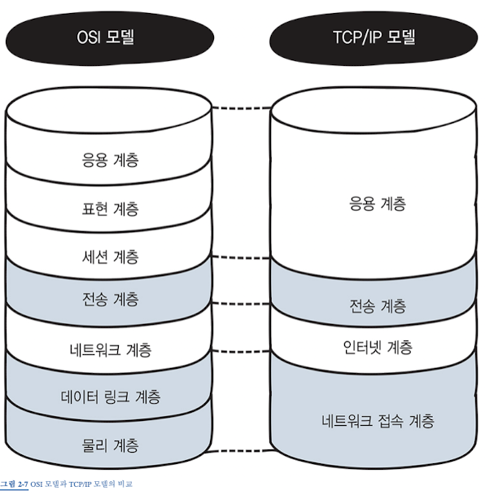

# OSI 7계층

> OSI 7계층이란, 네트워크 간 데이터를 주고받는 과정을 단계별로 구분지어 각 계층들이 어떤 역할을 하는지 설명하기 위한 개념이다.



| 계층  |               이름                |                                    설명                                    |
| :---: | :-------------------------------: | :------------------------------------------------------------------------: |
| 7계층 |   응용 계층(Application Layer)    | 이메일, 파일전송, 웹 사이트 조회 등 애플리케이션에 대한 서비스를 제공한다. |
| 6계층 |   표현 계층(Presentation Layer)   |              문자, 코드, 압축, 암호화 등의 데이터를 변환한다.              |
| 5계층 |     세션 계층(Session Layer)      |                      세션 체결, 통신 방식을 결정한다.                      |
| 4계층 |    전송 계층(Transport Layer)     |                      신뢰할 수 있는 통신을 구현한다.                       |
| 3계층 |   네트워크 계층(Network Layer)    |      다른 네트워크와 통신하기 위한 경로 설정 및 논리 주소를 결정한다.      |
| 2계층 | 데이터 링크 계층(Data Link Layer) |          네트워크 기기 간의 데이터 전송 및 물리 주소를 결정한다.           |
| 1계층 |     물리 계층(Physical Layer)     |         시스템 간의 물리적인 연결과 전기 신호를 변환 및 제어한다.          |

<br>
<br>

> 객체지향에서 다루는 캡슐화와는 조금 다른 네트워크상의 캡슐화

- PC 2대 간 데이터를 주고 받는 과정을 살펴보면, 데이터 송신 측 PC의 응용 계층에서 시작 해서 차례차례 계층간의 통신이 이루어 지는데, 이 때 각 계층을 지나칠 때 마다 전송하는 데이터의 앞부분에 전송하는 데에 필요한 정보를 붙여서 다음 계층으로 전송한다.
- 이처럼 헤더를 붙여 나가는걸 캡슐화 라고 한다.
- 전송된 데이터는 다시 수신 측 PC의 물리계층에 도달하여, 반대 방향으로 계층간의 통신이 이루어 지는데, 이 때 송신 측에서 붙여 놓은 헤더를 하나씩 제거한다.
- 이것을 역캡슐화 라고 한다.

<br>

## 1계층 - 물리계층(Physical Layer)

- 이 계층에서는, 전기 신호 <-> 데이터 간의 변환이 일어난다.
- 컴퓨터는 0과 1만 이해할 수 있기 때문에, 이 전기 신호를 비트열로 변환하거나, 비트열을 전기신호로 변환하게 된다.
- 이 변환은 컴퓨터에 내장 되어 있는 랜카드에서 일어나며, 물리계층에서는 단지 데이터를 전달만 할 뿐, 전송하려는 데이터가 무엇인지, 어떤 에러가 있는지 등에는 전혀 신경쓰지 않는다는 특징이 있다.

<br>

## 2계층 - 데이터 링크 계층(Data Link Layer)

- 이 계층에서는, 네트워크 장비 간에 신호를 주고받는 규칙을 정한다.
- 즉, LAN에서 데이터를 정상적으로 주고받기 위해 필요한 계층이다. 또한 그 규칙들 중 일반적으로 가장 범용성이 높은 규칙이 이더넷(Ethernet) 이다.
- 이 계층에서는 맥 주소를 가지고 통신하게 되고, 전송되는 데이터의 단위를 프레임 이라고 부르며, 대표적인 장비로는 브리지, 스위치 등이 있다.

> MAC 주소의 구조

```

```

<br>

## 3계층 - 네트워크 계층(Network Layer)

- 이 계층에서는, 다른 네트워크에 있는 목적지로 데이터를 전달한다. 직전의 데이터 링크 계층에서는 이더넷 규칙을 통해 같은 네트워크에 있는 컴퓨터로는 데이터를 전송할 수 있지만, 인터넷이나 다른 네트워크로는 데이터를 전송할 수 없다. <br>
- 이 계층에서 가장 중요한 기능은, 데이터를 목적지까지 가장 안전하고 빠르게 전달하는 기능(라우팅)이다.
- 이 계층에서는 IP 주소를 가지고 통신하며, 대표적인 장비는 라우터가 있다.

<br>

> IP란?

```
Internet Protocol의 줄임말. TCP/IP 상에서는 네트워크 주소(IP 주소)를 정의하고, IP 패킷의 전달 및 라우팅을 담당하는 계층. 공인IP와 사설IP로 나뉘며, 실제로 인터넷 서비스 공급자(ISP)가 제공하며 라우터에 할당되는 공인 IP주소가 핵심 역할을 한다.
```

## 4계층 - 전송 계층(Transport Layer)

- 이 계층에서는, 정확한 목적지에 신뢰할 수 있는 데이터를 전달한다.
- 오류를 점검하는 기능이 존재하며, 오류 발생 시 데이터 재전송을 요청한다.
- 또한 전달 받은 데이터가 어떤 애플리케이션에서 사용하는 데이터인지 식별, 판단한다.
- 이 계층에서 TCP 헤더가 붙게 되는데, 이 헤더 안에 포트 번호를 사용해서 목적지 애플리케이션을 식별한다.
  <br>

> 3-way handshake

```

```

> TCP / UDP

```

```

<br>

## 5계층 - 세션 계층(Session Layer)

- 이 계층은, 데이터가 통신하기 위한 논리적인 연결을 말한다.
- 보통 이 세션 계층과 이후의 6,7계층을 합하여 응용 계층이라고 묶어서 부르기도 한다.
- 이 계층은 TCP/IP 세션을 만들고 없애는 책임을 진다.

<br>

## 6계층 - 표현 계층(Presentation Layer)

- 데이터 표현이 상이한 응용 프로세스의 독립성을 제공하고, 암호화 한다.
- 코드간의 번역을 담당하여, 인코딩이나 암호화 등이 이 계층에서 이루어 진다.

<br>

## 7계층 - 응용 계층(Application Layer)

- 최종 목적지로서 HTTP, FTP, SMTP, POP3 등의 프로토콜이 있다.
- 응용 계층은 응용 프로세스와 직접 관계하여 일반적인 응용 서비스를 수행한다.
- 일반적인 응용 서비스는 관련된 응용 프로세스들 사이의 전환을 제공한다.

<br>

> 프로토콜의 종류

```
HTTP : 웹 사이트를 볼 때
DNS : 도메인을 해석하여 IP주소를 알아낼 때
FTP : 파일을 전송할 때
SMTP : 메일을 전송할 때
POP3 : 메일을 수신할 때
```

<br>
