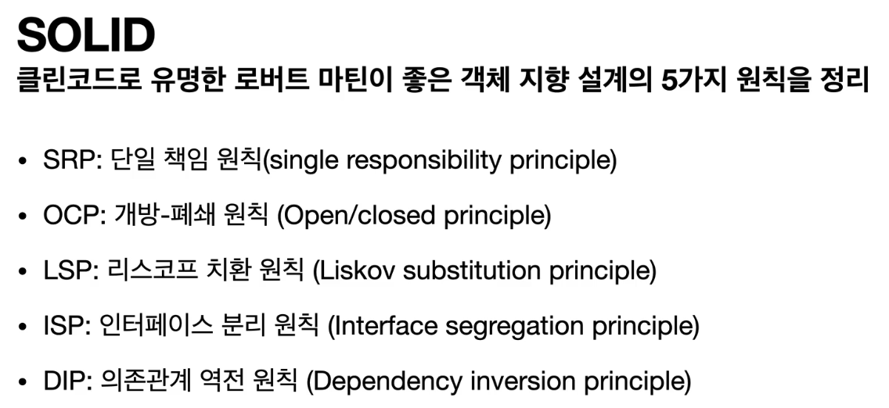
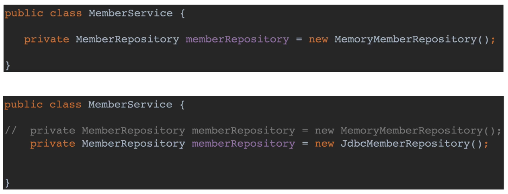

# SOLID

## 1. SRP

- 한 클래스는 하나의 책임만 가져야 한다.
- 하나의 책임이라는 것은 모호하다.
  - 클 수 있고, 작을 수 있다.
  - 문맥과 상황에 따라 다르다.
    중요한 기준은 변경이다. 변경이 일어났을때 파급효과가 적으면 적을수록 좋다.
    ex) UI 변경, 객체의 생성과 사용을 분리

## 2. OCP

- 가장 중요한 원칙. 확장에는 열려 있으나 변경에는 닫혀 있어야 한다.
- 다형성을 활용하면 위의 모순같은 원칙을 지킬 수 있다.
- 인터페이스를 구현한 새로운 클래스를 하나 만들어서 새로운 기능을 구현.

하지만 위의 그림을 보면, 다형성을 적용 시켰음에도 불구하고 repository 변경 시 코드도 같이 변경이 필요하다. 이유는, Service 클래스와 Repository가 직접 연결되어 있기 때문이다.

문제를 해결하기 위해서는, 객체를 생성하고, 연관관계를 맺어주는 별도의 조립, 설정자가 중간에 필요하다. 이를 스프링이 도와준다.

## 3. LSP 리스코프 치환 원칙

- 프로그램의 객체는 프로그램의 정확성을 깨뜨리지 않으면서 하위 타입의 인스턴스로 바꿀 수 있어야 한다.
- 다형성에서 하위 클래스는 인터페이스 규약을 다 지켜야 한다는 것, 다형성을 지원하기 위한 원칙, 인터페이스를 구현한 구현체는 믿고 사용하려면, 이 원칙이 필요하다.
- 단순히 컴파일에 성공하는 것을 넘어서는 이야기.
  ex) 자동차 인터페이스의 엑셀은 앞으로 가라는 기능, 뒤로 가게 구현하면 LSP 위반, 느리더라도 앞으로 가야함.

## 4. ISP 인터페이스 분리 원칙.

- 특정 클라이언트를 위한 인터페이스 여러 개가 범용 인터페이스 하나보다 낫다.
- 자동차 인터페이스 → 운전 인터페이스, 정비 인터페이스로 분리
- 사용자 클라이언트 → 운전자 클라이언트, 정비사 클라이언트로 분리
- 분리하면 정비 인터페이스 자체가 변해도 운전자 클라이언트에 영향 주지 않음.
- 인터페이스가 명확해지고, 대체 가능성이 높아진다.

## 5. DIP 의존관계 역전 원칙

- 프로그래머는 “추상화에 의존해야지, 구체화에 의존하면 안된다.”
- 구현 클래스에 의존하지 말고, 인터페이스에 의존 하라는 뜻이다.
- 앞에서 이야기한 역할(Role)에 의존하게 해야 한다는 것과 같다.
- 즉 클라이언트는 인터페이스에 의존해야, 유연하게 구현체를 변경 할 수 있다.
  구현체에 의존하게 되면 변경이 아주 어려워진다.

위에서 본 MemberService의 의존관계 문제는 현재의 다형성 만으로는 해결이 불가능하다. (OCP, DIP 위반) 무언가가 더 필요하다.

> 이 무언가의 역할을 스프링이 해준다.

스프링은 다음 기술로 다형성 + OCP, DIP를 가능하게 지원한다.

- DI(Dependenct Injection) : 의존관계, 의존성 주입
- DI 컨테이너 제공

이를 통해, 클라이언트 코드의 변경 없이 기능 확장이 가능하다.

---

> 모든 설계에 역할과 구현을 분리하자.

> 자동차, 공연의 예를 떠올려 보자.

> 역할만 설계하고, 배우는 언제든지 유연하게 변경할 수 있도록 만드는 것이 좋은 객체지향 설계다.
