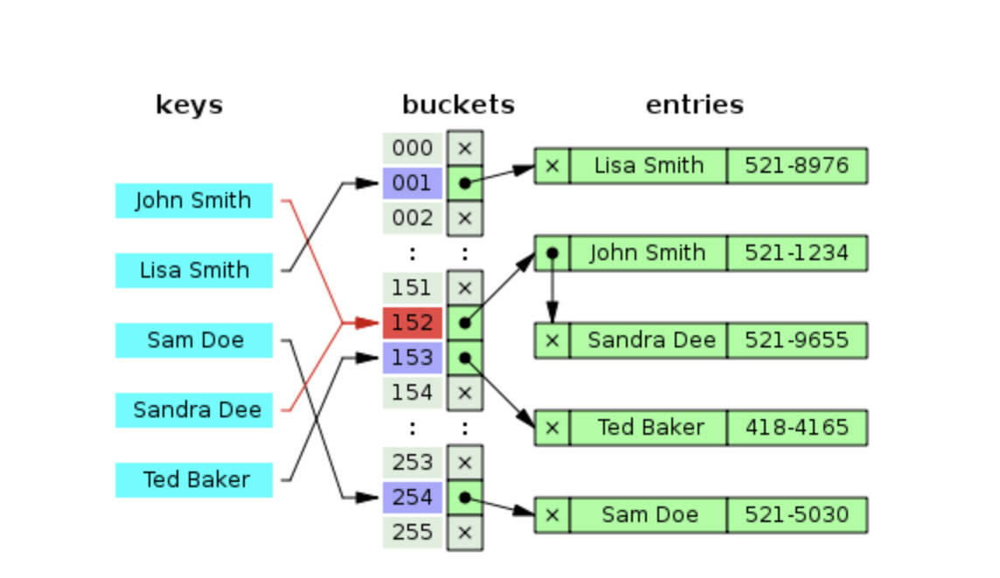

# Hash

## 1. Hashing

정의 : 주어진 key 혹은 문자열을 다른 값으로 변환시키는 과정. 후술할 해시 테이블의 구현에서 주로 많이 사용된다.

> A -> Hash function() -> B 와 같이, 항상 단방향으로 움직여야 하며, A 라는 input을 Hash 함수에 통과 시켰을때, 항상 B 라는 output이 나와야 한다.

## 2. 해시 함수

정의 : 임의의 길이를 갖는 임의의 데이터를 고정된 길이의 데이터로 매핑하는 단방향 함수를 의미함.

> A -> Hash function() -> B 에서, B 라는 output을 통해 최초의 input을 찾거나, 유추할 수 없다.

- Hash table 혹은 Hash Map이라는 형태로 O(1)의 시간 복잡도로 접근 하는데 사용된다.
- 특정 Key를 해싱해서 나오는 문자열에 Value들을 저장 해 놓음으로서, Key에 따라 바로 원하는 값을 찾을 수 있다.

## 3. 해시 테이블

정의 : Key, Value로 데이터를 저장하는 자료구조 중 하나로, 빠르게 데이터를 검색할 수 있는 자료구조이다.

위에서 말한 해시함수를 통해서 나온 결과물(키)을 배열의 고유한 index로 설정하고, 이 index를 활용해 값을 저장하거나 조회한다. 여기서 실제 값이 저장되는 장소를 버킷 혹은 슬롯 이라고 한다.

## 4. 해시 충돌(Hash Collision)

정의 : Hash function()을 거친 B 라는 output이 유일성을 만족하지 못하고 다른 output과 값이 동일할 경우, 이를 해시 충돌 이라고 한다.

해시 테이블에서 해시 충돌이 일어날 경우, 데이터를 저장하기 위한 다양한 방법이 있다.

---

### 4-1. 분리 연결법(Separate Chaining)

보통은 해시 충돌이 일어날 경우, 가까운 빈 공간을 찾아 해당 슬롯에 데이터를 저장하지만 이 분리 연결법을 사용하면 해시 충돌이 일어난 지점에서 추가 메모리를 사용하여 다음 데이터의 주소를 저장할 수 있다.

> 쉽게 말하면, 충돌이 일어난 지점에서 List 자료구조를 활용 해 마치 2차원 배열과 같은 데이터 구조를 사용하는 형식이다.



이러한 Chaining 방식은 해시 테이블의 확장이 필요 없고, 간단하게 구현이 가능하며 손쉽게 삭제할 수 있다는 장점이 있다. 하지만 데이터의 수가 많아지면 동일한 버킷에 chaining되는 데이터(충돌하는 Hash output)가 많아지며 그에 따라 캐시의 효율성이 감소한다는 단점이 있다.

---

### 4-2. 개방 주소법(Open Addressing)

개방 주소법이란, 추가적인 메모리를 사용하는 Chaining 방식과 다르게 비어있는 해시 테이블의 공간을 활용하는 방법이다. 이를 구현하기 위한 대표적인 방법으로 다음의 3가지 방식이 존재한다.

- Linear Probing: 현재의 버킷 index로 부터 고정폭 만큼씩 이동하여 차례대로 검색 해 비어있는 버킷에 데이터를 저장한다.

- Quadratic Probing: 해시의 저장 순서 폭을 제곱으로 저장하는 방식이다. 예를 들어, 처음 충돌이 발생 한 경우에는 1만큼 이동하고, 그 다음 계속 충돌이 발생하면 2^2, 3^2칸씩 옮기는 방식이다.

- Double Hashing Probing: 해시된 값을 한번 더 해싱하여 해시의 규칙성을 없애버리는 방식이다. 2번의 해싱이 필요하기 때문에, 다른 방법들 보다 많은 연산을 하게된다.


---

## 5. 대칭 키

정의 : 암호화와 복호화에 같은 암호키(대칭 키)를 사용하는 알고리즘.
동일한 키를 주고받기 때문에, 매우 빠르다는 장점이 있음.

## 6. 공개 키

정의 : 암호화와 복호화에 사용하는 암호키를 분리한 알고리즘.
대칭키의 키 분배 문제를 해결하기 위해 고안됨. (대칭키일 때는 송수신자 간만 키를 알아야 하기 때문에, 분배가 복잡하고 어렵지만 공개키와 비밀키로 분리할 경우, 남들이 알아도 되는 공개키만 공개하면 되므로)

> 공개 키 암호화 방식 진행 과정

1. A가 웹 상에 공개된 'B의 공개키'를 이용해 평문을 암호화하여 B에게 보냄.
2. B는 자신의 비밀키로 복호화한 평문을 확인, A의 공개키로 응답을 암호화 하여 A에게 보냄.
3. A는 자신의 비밀키로 암호화된 응답문을 복호화함.

## 7. equals()

정의 : Object 클래스에 정의되어 있는 함수. 기본적으로 2개의 객체가 동일한지 검사하기 위해 사용. 이 때 동일성을 파악하기 위한 방법으로, 두 객체의 참조값을 비교함. 즉, 두 객체가 가리키는 곳이 동일한 메모리 주소일 경우에만 동일한 객체가 됨.

```java
public boolean equals(Object obj) {
    return (this == obj);
}
```

하지만 프로그래밍을 하다보면, 가리키는 주소값이 달라도 동일한 객체로 보아야 하는 경우가 있음.
서로 다른 메모리에 띄워져 있지만, 같은 value를 지니고 있는 경우가 이에 해당. 따라서 이 경우에 equals 메소드를 오버라이딩 해 줘야 함.

예를들어 아래와 같이 동일한 값을 갖는 문자열을 2개 생성하면, 각 객체는 서로 다른 메모리에 띄워져 있어 동일한 객체로 인식되지 않음. 대신 같은 값을 지니므로 동등하다고 보아야 함. 하지만 String 클래스의 equals 메소드를 호출 해 보면 true가 나옴. 이유는 String 클래스에서 equals 메소드를 오버라이드 하여 객체가 같은 값(value)를 갖는지 동등성을 비교하도록 처리했기 때문이다.

```java

String s1 = new String("test");
String s2 = new String("test");

System.out.println(s1 == s2);
System.out.println(s1.equals(s2));
```

## 8. hashcode()

정의 : 해시 알고리즘을 통해, 실행 중에 객체의 유일한 integer 값을 반환한다.

> equals와 hashCode의 관계

> 동일한 객체는 동일한 메모리 주소를 갖음을 의미하므로, 동일한 객체는 동일한 해시코드를 가져야 한다. 그렇기 때문에 우리가 equals() 메소드를 오버라이드 한다면, hashCode() 메소드도 함께 오버라이드 되어야 한다.

이러한 equals와 hashCode의 관계를 정의하면 다음과 같다.

- Java 프로그램을 실행하는 동안 equals에 사용된 정보가 수정되지 않았다면, hashCode는 항상 동일한 정수값을 반환해야 한다.
- 두 객체가 equals()에 의해 동일하다면, 두 객체의 hashCode() 값도 일치해야 한다.
- 두 객체가 equals()에 의해 동일하지 않다면, 두 객체의 hashCode() 값은 일치하지 않아도 된다.
