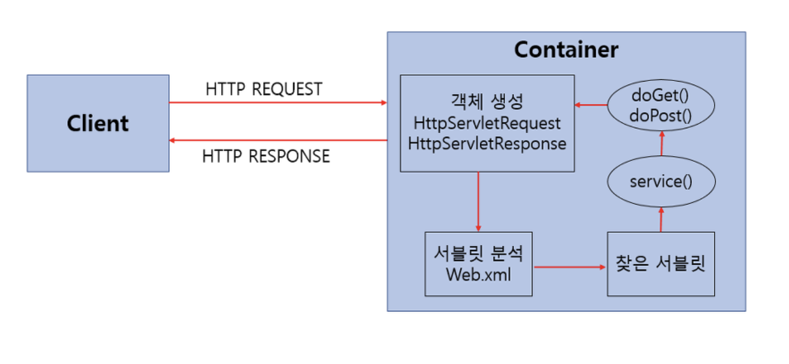

# Servlet

정의 : 웹 애플리케이션을 구성하는 하나의 구성요소로, 클라이언트의 요청을 처리하고 응답을 반환하는 역할을 한다. 보통 싱글톤 패턴으로 구현되어, 웹 애플리케이션에서 단 하나의 인스턴스만 존재하며 요청이 들어올 때 마다 재사용 된다. 이러한 구조로 인해 메모리 효율성과 성능이 향상됨.

## 서블릿의 특징

- 클라이언트의 요청에 대해 동적으로 작동하는 웹 어플리케이션 컴포넌트.
- html을 사용하여 요청에 응답.
- Java Thread를 이용하여 동작.
- MVC 패턴에서 Controller로 이용됨.
- HTTP 프로토콜 서비스를 지원하는 javax.servlet.http.HttpServlet 클래스를 상속받음.
- UDP보다 처리속도가 느림.
- HTML 변경 시 Servlet을 재컴파일 해야 하는 단점이 있음.

## 서블릿의 동작 방식

1. 사용자(클라이언트)가 URL을 입력하면 HTTP Request가 Servlet Container로 전송함.
2. 요청을 전송받은 Servlet Container는 HttpServletRequest, HttpServletResponse 객체를 생성함.
3. web.xml을 기반으로 사용자가 요청한 URL이 어느 서블릿에 대한 요청인지 찾습니다.
4. 해당 서블릿에서 service 메소드를 호출한 후, 클라이언트의 GET, POST 여부에 따라 doGet() 또는 doPost()를 호출.
5. doGet() or doPost() 메소드는 동적 페이지를 생성한 후 HttpServletResponse 객체에 응답을 보낸다.
6. 응답이 끝나면 HttpServletRequest, HttpServletResponse 두 객체를 소멸 시킨다.

 

## 서블릿 내장객체

| 이름        | 역할                                                       |
| ----------- | ---------------------------------------------------------- |
| request     | 웹 클라이언트의 요청 정보를 저장                           |
| response    | 요청에 대한 응답 정보를 저장                               |
| session     | 상태 유지를 위한 클라이언트 및 서버의 정보를 저장          |
| page        | 현재 jsp 페이지의 서블릿 객체. 현재 페이지에 대한 참조변수 |
| application | 웹 서버 내 동일 애플리케이션 처리 정보를 저장              |

## 서블릿 컨테이너

정의 : 서블릿을 관리 해 주는 컨테이너.

> 서블릿을 만들었다고 해서 스스로 작동하는게 아님. 서블릿을 관리 해 주는 요소가 필요함. 이게 바로 서블릿 컨테이너. 서블릿 컨테이너는 클라이언트의 요청을 받아주고, 응답할 수 있게 웹 서버와 소켓으로 통신하며 대표적인 예로 톰캣이 있음.

### Servlet Container의 역할

1. 웹서버와의 통신 지원
2. 서블릿 생명주기 관리
3. 멀티쓰레드 지원 및 관리
4. 선언적인 보안 관리
